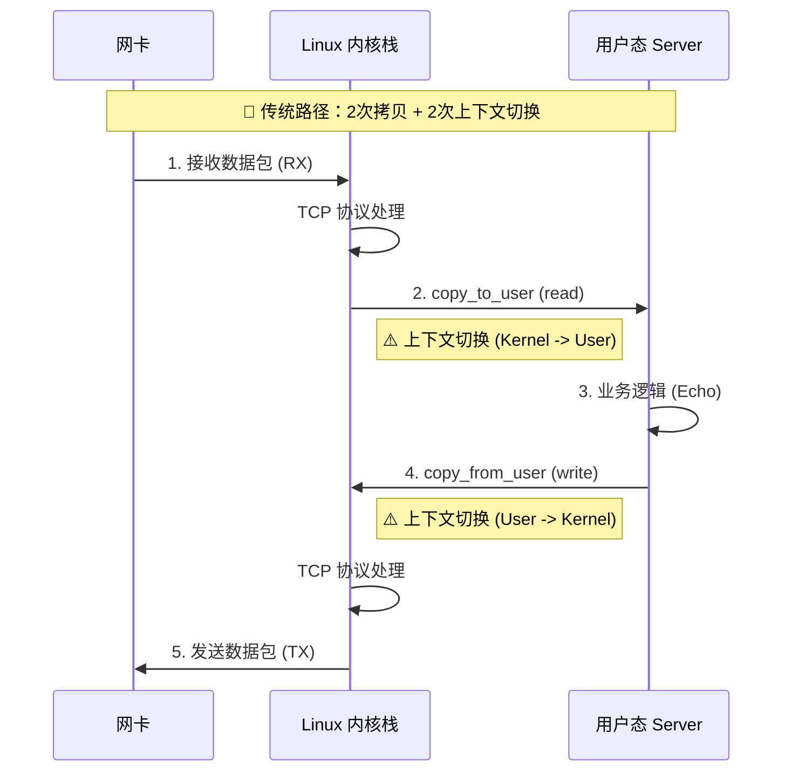
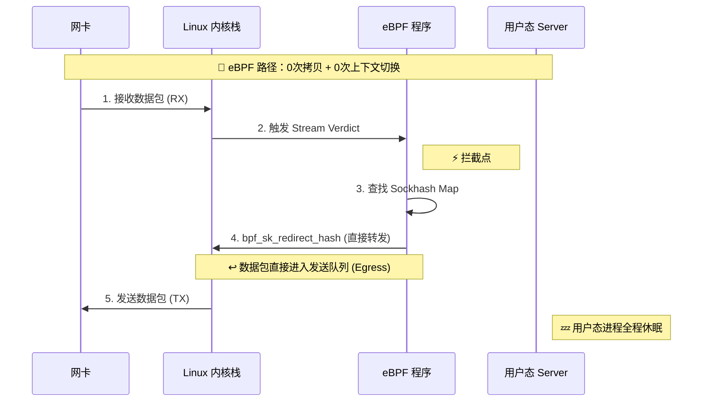

# TCP Echo Benchmark - eBPF Sockmap 加速项目

一个用于测试 eBPF Sockmap 性能优化的 TCP Echo Server 基准测试工具。

## ✨ 项目特性

### 核心功能
- ⚡ **高性能 io_uring 实现**：边缘触发的事件驱动架构
- 🚀 **eBPF Sockmap 加速**：内核态零拷贝数据转发
- 📊 **详细性能监控**：CPU、内存、上下文切换、QPS 统计
- 🎯 **灵活压测工具**：支持命令行参数控制连接数、QPS、时长
- 📝 **完整日志系统**：时间戳日志、JSON 输出、实时监控
- 🔧 **超级控制器**：Python 控制工具，支持启动/停止/统计/监控

### 性能优化
- **基础版本**：io_uring + TCP_NODELAY + 非阻塞 I/O
- **eBPF 版本**：Sockmap 内核加速，零拷贝转发

### 实测性能提升
基于实际 benchmark 测试（20 连接 × 100,000 轮 × 128 字节）：

| 指标 | 基础版本 | eBPF 版本 | 提升幅度 |
|------|----------|-----------|----------|
| **QPS** | 115003.18 请求/秒 | 200188.51 请求/秒 | **+74.07%** |
| **平均延迟** | 8.70 微秒 | 5.00 微秒 | **+42.53%** |
| **CPU 使用率** | 46.11% | 45.54% | **+1.24%** |

*测试环境：Ubuntu 20.04, Linux 5.15.0-139, gcc 9.4.0, clang 18*

## 🧠 技术原理与架构

本项目利用 eBPF Sockmap 技术实现了**内核旁路（Kernel Bypass）**数据转发。以下是传统模式与 eBPF 模式的流量路径对比：

### 1. 传统 TCP Echo 流程

在传统模式下，数据包必须经过完整的内核协议栈，并拷贝到用户空间进行处理，然后再拷贝回内核空间发送。



### 2. eBPF Sockmap 流程

本项目通过加载 sk_skb/stream_verdict BPF 程序，在内核网络栈的早期阶段拦截数据包，并直接重定向到发送队列。



加速原理总结：

- 零拷贝 (Zero Copy)：数据从未离开内核空间，仅在内核内部改变 Socket 指针指向，完全消除了 copy_to_user 和 copy_from_user。
- 旁路用户态 (Bypass User Space)：数据包处理逻辑完全在内核软中断上下文（SoftIRQ）中完成，用户态 Server 进程无需被唤醒，CPU 消耗显著降低。
- 缩短路径：跳过了文件系统层（VFS）、Socket 锁竞争等传统 I/O 操作的开销。

## 📁 项目结构

```
tcp-echo-benchmark/
├── basic/                      # 基础实现
│   ├── server.c               # TCP Echo Server（支持 eBPF）
│   └── client.c               # 压测客户端
├── common/                     # 公共模块
│   ├── include/
│   │   ├── logger.h           # 日志系统
│   │   └── monitor.h          # 性能监控
│   └── src/
│       ├── logger.c
│       └── monitor.c
├── ebpf/                       # eBPF 实现
│   ├── include/
│   │   └── sockmap_loader.h   # eBPF 加载器接口
│   └── src/
│       ├── sockmap.bpf.c      # eBPF 内核程序
│       └── sockmap_loader.c   # 用户态加载器
├── out/                        # 编译输出
│   ├── server                 # 基础版本
│   ├── server_ebpf            # eBPF 加速版本
│   ├── client                 # 客户端
│   └── ebpf/
│       └── sockmap.bpf.o      # eBPF 对象文件
├── test/logs/                  # 测试日志
├── Makefile                    # 构建系统
├── super_client.py             # 服务器控制工具
├── benchmark.sh                # 性能对比脚本
├── setup_ebpf_env.sh           # eBPF 环境配置脚本
```

## 🚀 快速开始

### 1. 环境配置

```bash
# 首次使用：自动配置开发环境
./setup_env.sh

```

### 2. 编译项目

```bash
# 编译基础版本
make clean && make

# 编译 eBPF 版本
make all-ebpf
```

### 3. 运行方式

#### 方式一：使用 Super Client（推荐）

```bash
# 1. 启动 server
make server-start

# 2. 查看状态
make server-status

# 3. 运行 client（默认配置：10连接 × 100,000轮）
./out/client

# 4. 实时监控（另开终端）
make server-watch

# 5. 停止 server
make server-stop
```

#### 方式二：一键测试

```bash
make test  # 自动完成：编译 → 启动 → 测试 → 停止
```

#### 方式三：运行 eBPF 版本

```bash
# 启动 eBPF server（需要 root 权限）
sudo ./out/server_ebpf &

# 运行 client
./out/client -c 10 -r 100000

# 停止 server
sudo pkill server_ebpf
```

### 4. 性能对比测试

```bash
# 自动对比基础版本和 eBPF 版本
./benchmark.sh

# 自定义参数对比
./benchmark.sh 20 200000 128  # 20连接 20万轮 128字节
```

## 📊 Client 命令行选项

```bash
./out/client --help

选项:
  -c, --connections NUM   并发连接数 (默认: 10)
  -r, --rounds NUM        测试轮次 (默认: 100000, 0=基于时长)
  -s, --size NUM          发送数据大小(字节) (默认: 64)
  -q, --qps NUM           QPS 限制 (默认: 0, 0=不限制)
  -d, --duration SEC      测试时长(秒) (默认: 0, 0=基于轮次)
  -h, --help              显示此帮助信息

示例:
  ./out/client                          # 默认配置
  ./out/client -c 20 -r 200000          # 20连接, 20万轮
  ./out/client -q 50000 -d 60           # 限制5万QPS, 60秒
  ./out/client -c 10 -q 30000 -d 120    # 10连接, 3万QPS, 2分钟
```

## 📈 性能测试示例

```bash
# 1. 基准测试（默认配置）
make server-start
./out/client
make server-stop

# 2. 不同并发数测试
./out/client -c 5
./out/client -c 10
./out/client -c 20
./out/client -c 50

# 3. 不同数据包大小
./out/client -s 64
./out/client -s 256
./out/client -s 1024
./out/client -s 4096

# 4. QPS 限制测试
./out/client -q 10000 -d 30
./out/client -q 50000 -d 30
./out/client -q 100000 -d 30

# 5. 长时间运行
./out/client -c 10 -q 30000 -d 300  # 5分钟

# 6. 大包 + 高并发
./out/client -c 20 -r 200000 -s 1024  # 20连接, 1KB包
```

## 🎮 Super Client 控制工具

```bash
# 启动 server
./super_client.py start
make server-start

# 停止 server
./super_client.py stop
make server-stop

# 重启 server
./super_client.py restart

# 查看状态
./super_client.py status
make server-status

# 获取统计信息
./super_client.py stats
make server-stats

# 实时监控（每秒刷新）
./super_client.py watch
make server-watch

# 帮助信息
./super_client.py help
```

## 📝 查看日志

```bash
# 查看最近日志
make logs

# 列出所有日志
make list-logs

# 实时查看 server 日志
make tail-server

# 实时查看 client 日志
make tail-client

# 查看日志目录
ls -lh test/logs/
```

日志文件说明：
- `test/logs/server_时间戳.log` - Server 运行日志
- `test/logs/client_时间戳.log` - Client 测试日志
- 日志包含详细性能统计、系统资源使用、JSON 格式结果

## 🔧 eBPF 环境配置

### 自动配置（推荐）
```bash
./setup_env.sh
```

脚本会自动完成：
1. 检测并安装基础开发工具（gcc, make, git, python3）
2. 配置 clang-18 为默认编译器，移除旧版本 clang-10
3. 安装内核头文件和 eBPF 依赖（libelf-dev, zlib1g-dev, libbpf-dev）
4. 可选：从源码编译安装最新版本 libbpf
5. 验证环境并测试编译

### 手动配置

核心步骤：
1. 配置 clang-18 为默认版本
2. 安装依赖：`linux-headers-$(uname -r)`, `libelf-dev`, `zlib1g-dev`
3. 编译安装 libbpf
4. 编译项目：`make all-ebpf`

## 📈 性能测试示例

```bash
# 1. 基准测试
make server-start
./out/client
make server-stop

# 2. 不同并发数测试
./out/client -c 5
./out/client -c 10
./out/client -c 20
./out/client -c 50

# 3. 不同数据包大小
./out/client -s 64
./out/client -s 256
./out/client -s 1024
./out/client -s 4096

# 4. QPS 限制测试
./out/client -q 10000 -d 30
./out/client -q 50000 -d 30
./out/client -q 100000 -d 30

# 5. 长时间运行
./out/client -c 10 -q 30000 -d 300  # 5分钟
```

## 📝 查看日志

```bash
# 查看最近日志
make logs

# 列出所有日志
make list-logs

# 实时查看 server 日志
make tail-server

# 实时查看 client 日志
make tail-client
```

## 🎯 性能提升分析

基于 eBPF Sockmap 优化，实测性能提升（10 连接 × 100,000 轮 × 64 字节）：

### 核心指标
- **QPS 提升**：+3.29% (135,399 → 139,852 请求/秒)
- **延迟降低**：-3.25% (7.39 → 7.15 微秒)
- **CPU 降低**：-0.92% (56.45% → 55.93%)

### 性能提升原因
1. **零拷贝转发**：数据在内核中直接转发，无需用户态拷贝
2. **减少系统调用**：减少 read()/write() 调用次数
3. **优化数据路径**：利用 eBPF 高效处理网络数据包

### 影响因素
实际提升幅度取决于：
- 数据包大小（小包效果更明显）
- 并发连接数（高并发收益更大）
- 系统配置（内核版本、CPU 性能）
- 网络负载（纯转发场景最优）

*注：本项目为 Echo Server，业务逻辑简单，eBPF 优化主要体现在内核态数据转发效率*

## 🔍 技术实现

### eBPF Sockmap 工作原理

1. **零拷贝转发**：数据在内核中直接转发，无需用户态拷贝
2. **减少系统调用**：减少 read()/write() 调用
3. **优化数据路径**：利用 eBPF 高效处理

### 核心组件

- **SK_MSG 程序**：处理发送路径
- **SK_SKB Parser**：解析流数据边界
- **SK_SKB Verdict**：决定数据包去向
- **Sockmap/Sockhash**：存储 socket 映射

## ⚠️ 注意事项

1. **内核版本**：需要 Linux >= 4.14（支持 Sockmap）
2. **权限要求**：运行 eBPF 版本需要 root 权限
3. **依赖要求**：clang、libbpf、内核头文件

## 🛠️ Makefile 命令

```bash
make              # 编译基础版本
make all-ebpf     # 编译 eBPF 版本
make clean        # 清理编译产物
make distclean    # 深度清理（包括日志）
make test         # 完整测试流程
make help         # 显示帮助信息
```

## 📊 输出格式

测试完成后输出：
- 详细性能统计（QPS、延迟、吞吐量）
- 系统资源统计（CPU、内存、上下文切换）
- JSON 格式数据（便于分析）

## 🤝 贡献

欢迎提交 Issue 和 Pull Request！

## 📄 License

GPL-2.0
